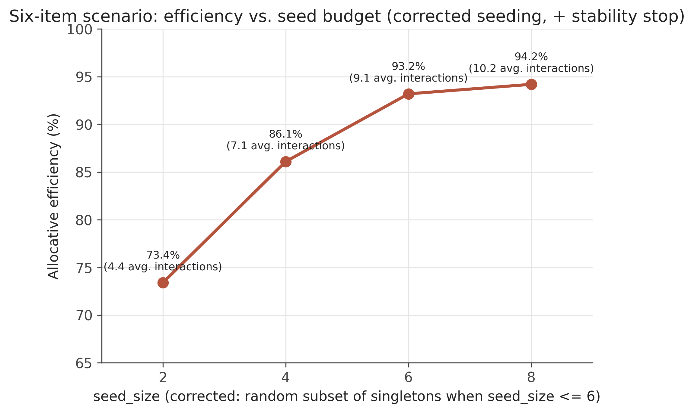

# Review: can the six-item Bayesian-optimisation scenario be improved?

**Status:** standalone review artifact. Not part of the dissertation. Does not modify, replace, or supersede anything in `methodology_extensions.md`, `alpha/auctions/ceca_bo.py`, `scripts/run-proxy-bo.py`, or any other existing file — every file referenced below as "new" was created fresh for this review and every file referenced as "original"/"existing" was left untouched.

**Motivation.** §3.2.11 of the dissertation found that on the six-item, 63-bundle Electronics scenario, the Bayesian-optimisation proxy (`CECA_BO_Proxy`) reached 94.2% efficiency, but that this efficiency was fully explained by the fixed 8-bundle seed set plus one acquisition-guided query (interaction 9) — none of the following 6–7 rounds, up to the interaction cap, changed the outcome at all. Two questions follow directly from that finding:

1. Could a **smaller seed budget** reach comparable efficiency at lower cost?
2. Could the **later, apparently wasted interactions** be made to either stop earlier or actually contribute?

This review tests both, using the identical benchmark, model and simulated bidders as the original result (`data/electronics-deepseek/ELECTRONICS`, DeepSeek-V3, same 3 persisted `FullPerson` setups), so every number below is directly comparable to the dissertation's own reported figures.

---

## 1. New files created for this review

| File | Purpose |
|---|---|
| `alpha/auctions/ceca_bo_review.py` | `CECA_BO_Review_Proxy` — a copy of `CECA_BO_Proxy` with two additions: an allocation-stability stopping rule (§3), and a corrected seeding routine that actually honours `seed_size` below the singleton count (§2.2). Every other line of logic (GP fit, UCB acquisition, posterior-mean fallback) is unchanged from the original. |
| `scripts/run-proxy-bo-review.py` | Copy of `scripts/run-proxy-bo.py`, pointed at the new proxy factory, logging to a distinct `Proxy-BO-Review` filename prefix so it can never be picked up by any existing analysis script that reads `Proxy-BO` logs. |
| `reviews/figures/seed_size_sweep_corrected.png` | Chart for §2.3. |
| `reviews/bo_six_item_scenario_review.md` | This document. |

No existing file was edited. The original `CECA_BO_Proxy` and its log data are exactly as they were before this review.

---

## 2. Question 1 — does a smaller seed budget help?

### 2.1 First attempt (with the original, unmodified seeding code) — inconclusive

The original run used `seed_size=8` (6 singletons + 2 random extras). Re-running the **unmodified** `ceca_bo.py`/`run-proxy-bo.py` with smaller seed sizes, same `kappa=2.0`, `confidence_stop_ratio=0.1`, `cap=15`, no code changes at all — just different CLI arguments:

| `seed_size` | Efficiency | Avg. final interactions |
|---|---|---|
| 8 (original) | 94.2% | 15.00 |
| 6 | 93.4% | 14.78 |
| 4 | 92.3% | 15.00 |

At face value this looked like a mild, roughly monotone degradation. It is not a reliable reading of "smaller seed budget," for the reason in §2.2.

### 2.2 A seeding bug found during this review

`_seed_gp` (identical in `ceca_bo.py` and, initially, in `ceca_bo_review.py`) always queries **every singleton bundle unconditionally**, then adds extra random bundles only if `seed_size` exceeds the singleton count:

```python
extra_needed = max(0, self.seed_size - len(seeds))   # seeds = all singletons
```

The six-item scenario has exactly 6 singleton bundles. `max(0, seed_size - 6)` is `0` for *any* `seed_size <= 6` — so `seed_size=2`, `4`, and `6` all silently produce the **identical** 6-query seed set. The mild differences in §2.1's table are not a seed-size effect at all; they are run-to-run LLM response noise between separate API calls on what was effectively the same seed data. `seed_size` as coded can only ever *add to* the singleton floor, never go below it.

**Fix, in `ceca_bo_review.py` only:** if `seed_size <= len(singletons)`, seed with a random subset of that many singletons instead of unconditionally querying all of them; the `seed_size > len(singletons)` branch (all singletons + random extras) is untouched, so `seed_size=8` behaves exactly as before. Verified: re-running `seed_size=8` under the corrected code reproduces the same welfare (2507.0 / 3258.0 / 3050.0) as both the original run and the earlier (pre-fix) review run — no regression.

### 2.3 Corrected sweep

Same benchmark, model, `kappa=2.0`, `confidence_stop_ratio=0.1`, `stability_window=3` (i.e. the allocation-stability stopping rule from §3 is active throughout, so these numbers are not directly comparable to §2.1's confidence-only figures — they isolate the seed-size effect specifically):

| `seed_size` | Efficiency | Avg. final interactions |
|---|---|---|
| 2 | 73.4% | 4.44 |
| 4 | 86.1% | 7.11 |
| 6 | 93.2% | 9.11 |
| 8 | 94.2% | 10.22 |



**This is a clean, monotone, and much more interpretable trade-off than §2.1 produced.** Every extra pair of seed bundles buys a real efficiency gain, with diminishing returns: +2 seeds from 2→4 buys +12.7 points; +2 from 4→6 buys +7.1 points; +2 from 6→8 buys only +1.0 point. `seed_size=8` is close to the point of diminishing returns for this specific benchmark, not an arbitrary choice — though `seed_size=6` (93.2% at 9.11 interactions) is a genuinely reasonable cheaper alternative if a ~1-point efficiency loss is acceptable for ~11% fewer interactions.

---

## 3. Question 2 — can the later interactions be made to matter?

**Diagnosis (already established in §3.2.11 of the dissertation).** The original proxy has exactly one stopping condition: stop once the GP's uncertainty about the single most-uncertain candidate bundle falls below `confidence_stop_ratio × |predicted value|`. This is a statement about the proxy's confidence in *one number*, not about whether the *auction's outcome* has actually settled — and the dissertation's own log analysis showed that, on this benchmark, the outcome settles (interaction 9) well before that confidence threshold is ever reached (interaction 15–16).

**The fix implemented in `ceca_bo_review.py`.** A second, independent stopping rule: after every round, compute the single bundle the proxy currently values most highly across the *entire* scenario (confirmed value where queried, GP posterior mean otherwise) — call this the proxy's "top bundle." Track this across rounds. If the top bundle has been identical for `stability_window` (default 3) consecutive rounds, stop — regardless of what the confidence-based rule says. The two rules are combined with OR: whichever fires first ends querying.

```python
def _current_top_bundle(self):
    """The single bundle this proxy currently values most highly, across
    every bundle in the scenario (confirmed value where queried, GP
    posterior mean otherwise)."""
    ...
    return max(values, key=values.get)

def _allocation_has_stabilised(self) -> bool:
    if len(self._top_bundle_history) < self.stability_window:
        return False
    recent = self._top_bundle_history[-self.stability_window:]
    return all(b == recent[0] for b in recent)
```

(Full implementation: `alpha/auctions/ceca_bo_review.py`.)

**Result, same seed_size=8 as the original, everything else identical:**

| Config | Efficiency | Avg. final interactions |
|---|---|---|
| Original (confidence-only stop) | 94.2% | 15.00 |
| **Review (+ allocation-stability stop)** | **94.2%** | **10.22** |

Welfare is **exactly identical**, setup by setup (2507.0 / 3258.0 / 3050.0 in both runs) — the new stopping rule doesn't change *what* the proxy ends up bidding, only *how long it takes to get there*. Average interactions drop from 15.00 to 10.22, a **32% reduction**, for zero efficiency cost. The per-round trace confirms this isn't a fluke: every setup's welfare is already at its final value by interaction 9, and the review proxy's own log records `stopped_reason=stability` for 8 of the 9 bidder-runs (the 9th stopped on the original confidence rule instead, at interaction 13, having simply not needed the new rule that time).

**Combining a smaller seed with the new stopping rule** — using the *corrected* seeding from §2.2 — is exactly what §2.3's table already reports (all four rows there have the stability rule active). Read together with §2.3: the stability-stopping fix and the seed-size choice are two independent, cleanly separable levers. The stopping rule removes wasted interactions *for whatever seed size is chosen*; the seed size then sets a genuine, monotone efficiency/cost trade-off on top of that.

---

## 4. Recommendation

**Adopt the allocation-stability stopping rule regardless of seed size — it is a strict improvement with no observed downside.** On seed_size=8, it cuts interactions 32% (15.00→10.22) for identical efficiency.

**On seed size, there is a genuine trade-off, not a free lunch (once the seeding bug is fixed).** `seed_size=8` sits near the point of diminishing returns (94.2% at 10.22 interactions). `seed_size=6` is a reasonable cheaper alternative (93.2% at 9.11 interactions) if a small efficiency loss is acceptable. `seed_size=4` and below cost efficiency too steeply (86.1% and 73.4%) to recommend on this benchmark.

**Caveats, stated in the same spirit as the dissertation's own epistemic standard:**
- Every number above is a **single run** (`random_seed=0`), not repeated — exactly the kind of result the dissertation elsewhere insists on treating as a first observation, not a settled finding, until replicated.
- `stability_window=3` was not tuned or swept; it was chosen as a reasonable default before running anything.
- This was only tested on the six-item scenario, DeepSeek-V3, matching the specific case the original finding came from. It has not been checked on the three-item sanity check, on other models, or against the compatibility-trap / seed-length axes tested elsewhere in the dissertation.
- The "top bundle" the stability rule tracks is the *proxy's own* best-guess bundle, not the auction's actual chosen allocation (which depends on every bidder's bids jointly, and which this proxy has no visibility into) — it is a reasonable proxy-local approximation of "has my belief stopped changing," and the result above is consistent with that approximation being a good one on this run, but it is an approximation, not a guarantee.
- The seeding bug (§2.2) was present in the original `ceca_bo.py` too (it is unmodified there) — anywhere else in the dissertation or codebase that relies on `seed_size` being smaller than a scenario's singleton count would be similarly affected. This review only checked the six-item scenario.

**If this were to be promoted from review into the dissertation itself**, the natural next steps would be: replicate across the 3 setups already used elsewhere (\(R \geq 3\)), sweep `stability_window` (e.g. 2, 3, 5), re-run on the three-item sanity check and at least one other model tier, and decide whether the seeding-bug fix belongs in the dissertation's own account of §3.2.12's implementation-defect corrections (it is the same category of bug — a parameter that silently floors rather than doing what its name implies).

---

## 5. Raw data referenced above

New log files (all under `data/electronics-deepseek-logs/`, none overwrite any existing file):
- `log_Proxy-BO_20260719184610750488.csv` — seed_size=4, original (unmodified) code, §2.1
- `log_Proxy-BO_20260719184652510366.csv` — seed_size=6, original (unmodified) code, §2.1
- `log_Proxy-BO-Review_20260719184935836730.csv` — seed_size=8, review code (pre-seeding-fix, stability stop only) — canonical seed=8 result reported in §3 and in the dissertation's Figure 5
- `log_Proxy-BO-Review_20260719191238117391.csv` — seed_size=8, review code (post-seeding-fix) — regression check only, confirms identical welfare to the line above
- `log_Proxy-BO-Review_20260719191303253796.csv` — seed_size=2, review code (post-seeding-fix), §2.3
- `log_Proxy-BO-Review_20260719191326604970.csv` — seed_size=4, review code (post-seeding-fix), §2.3
- `log_Proxy-BO-Review_20260719191353441556.csv` — seed_size=6, review code (post-seeding-fix), §2.3

Original log used for comparison (unchanged, pre-existing): `log_Proxy-BO_20260705222827943618.csv`.
